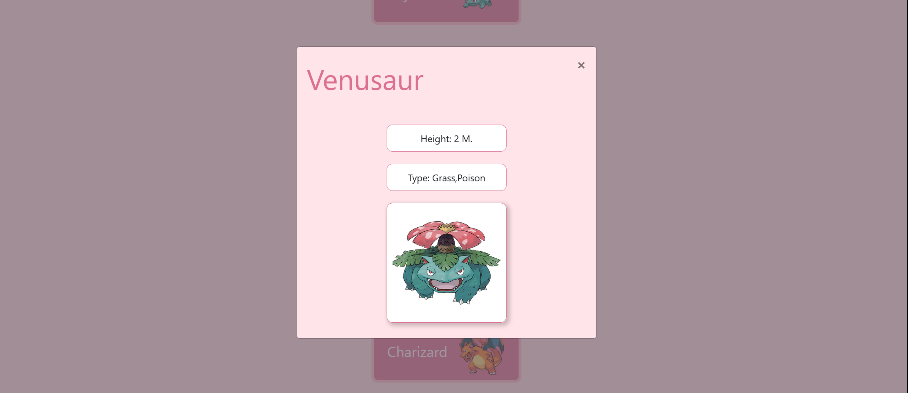

# POKEDEX WEB APP 💥

Goal: To build a small web application with HTML, CSS, and JavaScript that loads
data from an external API and enables the viewing of data points in detail.

### Overview

- Initially this application was coded in HTML/CSS/JS
- Afterwards I reworked the whole app structure to implement Bootstrap (specially the Modal and Navbar Features).

- Pokemon data loaded from https://pokeapi.co/

- Contains a list with 150 pokemons
- Click on a pokemon for more detailed information
- Hovering on pokemon image inside card reveals ✨shiny✨ version!

### Link to the App:

https://brunabrunabruna.github.io/pokedex/

### Technologies

the Pokedex Website was written in the following languages:

- HTML
- CSS
- Javascript

Using libraries:

- Bootstrap
- Polyfil (used for Fetch and Promise)
